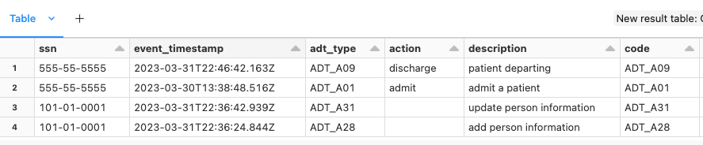

# 🔥 dbignite
__Health Data Interoperability__

[]([https://codecov.io/github/databrickslabs/dbignite](https://github.com/databrickslabs/dbignite))

This library is designed to provide a low friction entry to performing analytics on 
[FHIR](https://hl7.org/fhir/bundle.html) bundles by extracting resources and flattening. 

# Table of Contents 

[Installation](#installation)  

[Read & Analyze a FHIR Bundle](#usage-read--analyze-a-fhir-bundle)  
[SQL on FHIR](#sql-on-fhir)  
[DataFrames for FHIR](#dataframes-for-fhir)  
[Ex. Reading non-compliant FHIR Data](#ex-reading-non-compliant-fhir-data)  
[Ex. Hospital Patient Flow](#usage-seeing-a-patient-flow-in-a-hospital-in-real-time)  

[Writing FHIR Data](#usage-writing-fhir-data-using-no-codelow-code)  


[Omop Common Data Model](dbignite/omop)  

[Internal Representation of a FHIR Bundle in DBIgnite](#internal-representation-of-a-fhir-bundle-in-dbignite)  

# Usage

## Installation
```
pip install git+https://github.com/databrickslabs/dbignite.git
```
For a more detailed Demo, clone repo into Databricks and refer to the notebook [dbignite_patient_sample.py](./notebooks/dbignite_patient_sample.py)

## Usage: Read & Analyze a FHIR Bundle

### 1. FHIR representations

``` python 
from  dbignite.fhir_mapping_model import FhirSchemaModel
fhir_schema = FhirSchemaModel()

#list all supported FHIR resources
sorted(fhir_schema.list_keys()) # ['Account', 'ActivityDefinition', 'ActorDefinition'...

#only use a subset of FHIR resources (built in CORE list)
fhir_core = FhirSchemaModel().us_core_fhir_resource_mapping()
sorted(fhir_core.list_keys()) # ['AllergyIntolerance', 'CarePlan', 'CareTeam', 'Condition', ...

#create your own custom resource list
fhir_custom = FhirSchemaModel().custom_fhir_resource_mapping(['Patient', 'Claim', 'Condition'])
sorted(fhir_custom.list_keys()) # ['Claim', 'Condition', 'Patient']

#create your own custom schema mapping (advanced usage, not recommended)
# ... FhirSchemaModel(fhir_resource_map = <your dictionary of resource to spark schema>)
```

### 2. FHIR interpretation for analytics

#### Summary Level FHIR Bundle Information

``` python
from pyspark.sql.functions import size,col, sum
from dbignite.readers import read_from_directory

#Read sample FHIR Bundle data from this repo
sample_data = "./sampledata/*json"
bundle = read_from_directory(sample_data)

#Read all the bundles and parse
bundle.entry()

#Show the total number of patient resources in all bundles
bundle.count_resource_type("Patient").show() 
#+------------+                                                                  
#|resource_sum|
#+------------+
#|           3|
#+------------+
#

#Show number of patient resources within each bundle 
bundle.count_within_bundle_resource_type("Patient").show()
#+-------------------+
#|resource_bundle_sum|
#+-------------------+
#|                  1|
#|                  1|
#|                  1|
#+-------------------+

#Support for ndjson data format ex see: https://build.fhir.org/ig/HL7/bulk-data/export.html#bulk-data-output-file-request
from dbignite.readers import FhirFormat
sample_data = "./sampledata/ndjson_records/*json"
bundle = read_from_directory(sample_data, FhirFormat.NDJSON)

#Read all the bundles and parse
bundle.entry()

#Show the total number of patient resources in the ndjson formatted data
bundle.count_resource_type("Patient").show()
+------------+                                                                  
|resource_sum|
+------------+
|           1|
+------------+
```

## SQL on FHIR
> [!TIP] 
> For very large batches of FHIR, use bundle.entry().cache() before calling bulk_table_write for best performance

``` python
%python
#Save Claim and Patient data to a table
spark.sql("""DROP TABLE IF EXISTS hls_dev.default.claim""")
spark.sql("""DROP TABLE IF EXISTS hls_dev.default.patient""")

bundle.bulk_table_write(location="hls_healthcare.hls_dev" 
  ,write_mode="overwrite"
  ,columns=["Patient", "Claim"]) #if columns is not specified, all columns of the dataframe are written (157 resources are written with default settings)
```

``` SQL
%sql
-- Select claim line detailed information
select p.bundleUUID as UNIQUE_FHIR_ID, 
  p.Patient.id as patient_id,
  p.patient.birthDate,
  c.claim.patient as claim_patient_id, 
  c.claim.id as claim_id,
  c.claim.type.coding.code[0] as claim_type_cd, --837I = Institutional, 837P = Professional
  c.claim.insurance.coverage[0],
  c.claim.total.value as claim_billed_amount,
  c.claim.item.productOrService.coding.display as procedure_description,
  c.claim.item.productOrService.coding.code as procedure_code,
  c.claim.item.productOrService.coding.system as procedure_coding_system
from (select bundleUUID, explode(Patient) as patient from hls_dev.default.patient) p --all patient information
  inner join (select bundleUUID, explode(claim) as claim from hls_dev.default.claim) c --all claims from that patient 
    on p.bundleUUID = c.bundleUUID --Only show records that were bundled together
limit 100
```

## DataFrames for FHIR

Perform same functionality above, except using Dataframe only

``` python
%python
df = bundle.entry()

df.select(explode("Patient").alias("Patient"), col("bundleUUID"), col("Claim")).select(col("Patient"), col("bundleUUID"), explode("Claim").alias("Claim")).select(
  col("bundleUUID").alias("UNIQUE_FHIR_ID"), 
  col("patient.id").alias("Patient"),
  col("claim.patient").alias("claim_patient_id"),
  col("claim.id").alias("claim_id"),
  col("patient.birthDate").alias("Birth_date"),
  col("claim.type.coding.code")[0].alias("claim_type_cd"),
  col("claim.insurance.coverage")[0].alias("insurer"),
  col("claim.total.value").alias("claim_billed_amount"),
  col("claim.item.productOrService.coding.display").alias("prcdr_description"),
  col("claim.item.productOrService.coding.code").alias("prcdr_cd"),
  col("claim.item.productOrService.coding.system").alias("prcdr_coding_system")
).show()

```

## Ex. Reading non-compliant FHIR Data

Medication details are saved in a non-compliant FHIR schema. Update the schema to read this information under "medicationCodeableConcept"

``` python
%python
med_schema = df.select(explode("MedicationRequest").alias("MedicationRequest")).schema
#Add the medicationCodeableConcept schema in
medCodeableConcept = StructField("medicationCodeableConcept", StructType([
              StructField("text",StringType()),
              StructField("coding", ArrayType(
                StructType([
                    StructField("code", StringType()),
                    StructField("display", StringType()),
                    StructField("system", StringType()),
                ])
              ))
    ]))

med_schema.fields[0].dataType.add(medCodeableConcept) #Add StructField one level below MedicationRequest

#reconstruct the schema object with updated Medication schema
old_schemas = {k:v for (k,v) in FhirSchemaModel().fhir_resource_map.items() if k != 'MedicationRequest'}
new_schemas = {**old_schemas, **{'MedicationRequest': med_schema.fields[0].dataType} }

#reread in the data
bundle = read_from_directory(sample_data)
df = bundle.entry(schemas = FhirSchemaModel(fhir_resource_map = new_schemas))

df.select(explode("Patient").alias("Patient"), col("bundleUUID"), col("MedicationRequest")).select(col("Patient"), col("bundleUUID"), explode(col("MedicationRequest")).alias("MedicationRequest")).select(
  col("bundleUUID").alias("UNIQUE_FHIR_ID"), 
  col("patient.id").alias("Patient"),
  col("MedicationRequest.status"),
  col("MedicationRequest.intent"),
  col("MedicationRequest.authoredOn"),
  col("MedicationRequest.medicationCodeableConcept.text").alias("rx_text"),
  col("MedicationRequest.medicationCodeableConcept.coding.code")[0].alias("rx_code"),
  col("MedicationRequest.medicationCodeableConcept.coding.system")[0].alias("code_type")
).show()

```

## Usage: Seeing a Patient flow in a Hospital in Real Time  

Patient flow is driven by ADT message headers (Admission, Discharge, & Transfers). We are able to parse sample FHIR [ADT Data](./sampledata/adt_records) from this repo and associate "actions" with each message type. In conjunction with our patners at [Redox](https://www.redoxengine.com/), we are able to do this in real time and see patient flow, latest patient status, etc.

Import ADT package & read FHIR data

``` python
%python
import os, uuid
from pyspark.sql.functions import *
from dbignite.readers import read_from_directory
from dbignite.hosp_feeds.adt import ADTActions

#Side effect of creating the UDF to see actions from ADT messages 
#SELECT get_action("ADT") -> action : "discharge" , description : "transfer an inpatient to outpatient"
ADTActions()

sample_data = "file:///" + os.getcwd() + "/../sampledata/adt_records/"
bundle = read_from_directory(sample_data)
```

Create relational tables for Patient and MessageHeader data types
 
``` sql
%python
bundle.bulk_table_write(location="hls_healthcare.fhir" 
  ,write_mode="overwrite"
  ,columns=["Patient", "MessageHeader"]) #if columns is not specified, all resources are written by default
```

Sample results and query used against relational tables above that shows patient flow in the hospital setting (fake data shown) 



``` sql
%sql
Select 
--SSN value for patient matching
filter(patient.identifier, x -> x.system == 'http://hl7.org/fhir/sid/us-ssn')[0].value as ssn
,adt.timestamp as event_timestamp

--ADT action
,adt.messageheader.eventCoding.code as adt_type
,get_action(adt.messageheader.eventCoding.code).action as action
,get_action(adt.messageheader.eventCoding.code).description as description
,adt.messageheader.eventCoding.code
,adt.messageheader.eventCoding.system 

--Patient Resource Details 
,patient.name[0].given[0] as first_name
,patient.name[0].family as last_name
,patient.birthDate
,patient.gender
--Selecting Driver's license number identifier code='DL'
,filter(patient.identifier, x -> x.type.coding[0].code == 'DL')[0].value as drivers_license_id
--Master Patient Index Value for patient matching
,filter(patient.identifier, x -> x.type.text == 'EMPI')[0].value as empi_id

from (select timestamp, bundleUUID, explode(MessageHeader) as messageheader from hls_healthcare.hls_dev.adt_message) adt
  inner join (select bundleUUID, explode(Patient) as patient from hls_healthcare.hls_dev.patient) patient 
    on patient.bundleUUID = adt.bundleUUID
  order by ssn desc, timestamp desc
limit 10
```

## Usage: Writing FHIR Data Using No Code/Low Code

Writing FHIR is supported from Dataframes into standard FHIR schemas thanks to contributions from our partners at [XponentL Data](https://xponentl.ai/). This can be accomplished only by defining a mapping of src column to FHIR column and the export is by row as a FHIR bundle. 

e.g.

``` python
from dbignite.writer.bundler import *
from dbignite.writer.fhir_encoder import *

# Create a dummy Dataframe with 2 rows of data
data = spark.createDataFrame([('CLM123', 'PAT01', 'COH123'), ('CLM345', 'PAT02', 'COH123')],['CLAIM_ID', 'PATIENT_ID', 'PATIENT_COHORT_NUM'])

# Define a mapping from DF columns to FHIR Schema, including a hardcoded value for Patient.identifier.system
maps = [Mapping('CLAIM_ID', 'Claim.id'), 
		Mapping('PATIENT_COHORT_NUM', 'Patient.identifier.value'),
    Mapping('<url of a hardcoded system reference>', 'Patient.identifier.system', True),
		Mapping('PATIENT_ID', 'Patient.id')]

# Instance of the encoder & bundle writer
#  - Encoder transforms data to valid FHIR format in Spark
#  - bundler maps data to json format
m = MappingManager(maps, data.schema)
b = Bundle(m)
result = b.df_to_fhir(data)

#Pretty printing the resulting RDD
import json
result.map(lambda x: json.loads(x)).foreach(lambda x: print(json.dumps(x, indent=4)))
"""
#Row 1 in FHIR format
{
    "resourceType": "Bundle",
    "entry": [
        {
            "resource": {
                "resourceType": "Claim",
                "id": "CLM123"
            }
        },
        {
            "resource": {
                "resourceType": "Patient",
                "id": "PAT01",
                "identifier": [
                    {
                        "system": "<url of a hardcoded system reference>",
                        "value": "COH123"
                    }
                ]
            }
        }
    ]
}
#Row 2 in FHIR format
{
    "resourceType": "Bundle",
    "entry": [
        {
            "resource": {
                "resourceType": "Claim",
                "id": "CLM345"
            }
        },
        {
            "resource": {
                "resourceType": "Patient",
                "id": "PAT02",
                "identifier": [
                    {
                        "system": "<url of a hardcoded system reference>",
                        "value": "COH123"
                    }
                ]
            }
        }
    ]
}
"""
```

For limitations and more advanced usage, see [sample notebook](notebooks/dbignite_patient_sample.py#L461-L576)


## Internal Representation of a FHIR Bundle in DBIgnite

The core of a  FHIR bundle is the list of entry resources. This information is flattened into individual columns grouped by resourceType in DBIgnite. The following examples depict common uses and interactions. 


