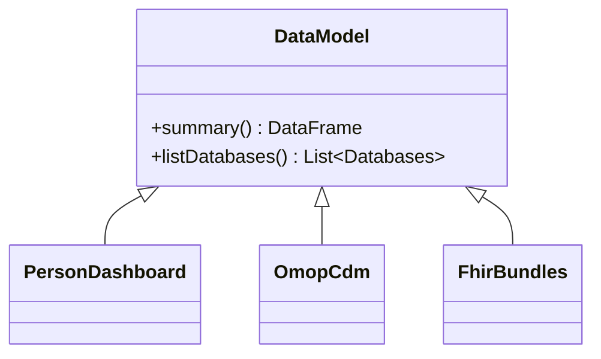
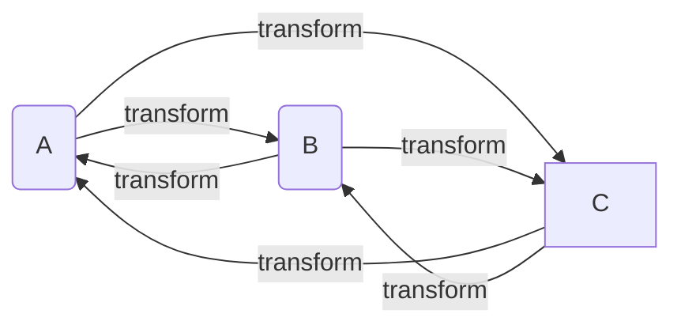
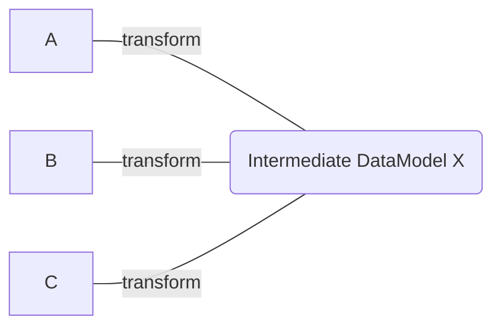
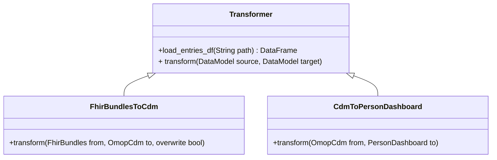

# 🔥 dbignite
__Health Data Interoperability__

This library is designed to provide a low friction entry to performing analytics on 
[FHIR](https://hl7.org/fhir/bundle.html) bundles by extracting resources and flattening. 

# Usage

>  **Warning** 
> This section has not been updated to reflect latest package updates
> 
## Installation
```
pip install git+https://github.com/databricks-industry-solutions/dbignite.git
```

## Usage: Analysis of a FHIR Bundle

## Usage: OMOP Common Data Model 

The _data_model_ module contains a suite of common
health data models such as FHIR, or OMOP CDM. 

See: [DataModels](#datamodels)

### Example:
Specify the name of the schema:
```
cdm_database='dbignite_demo' 
```
create data model objects:
```
fhir_model=FhirBundles(path=TEST_BUNDLE_PATH)
cdm_model=OmopCdm(cdm_database)
```
create a transformer and transform from FHIR to OMOP CDM:
```
FhirBundlesToCdm().transform(fhir_model, cdm_model, True)
```

The returned value of the `cdm` is an OmopCDM object with an associated database (`dbignite_demo`), containing the following tables:

- condition
- encounter
- person
- procedure_occurrence

Which are automaically created and added to the specified schema (`'dbignite_demo'` in the example above).
As a usecase, one can simply construct cohorts based on these tables and add the cohorts to the same schema or a new schema:
For example to select all male patients born before 1982:

`select * from dbignite_demo.person where year_of_birth < 1982 and gender_source_value='male'` 

> [See this in a notebook.](notebooks/dbignite-demo.py)

# Interop Pipeline Design

## DataModels
_DataModels_ hold the state of an interoperable _DataModel_ 
such as FHIR bundles, or OMOP CDM. The _Transformer_ class contains 
pre-defined transformations from one data model to another one.
> [see Transformers](#Transformers)



## Transformers
One of the key challenges for interoperability of data models is a
"many to many" problem. Support for any new data model requires
cross compatability with many other data models. Intermediate
data models can mitigate this issue.

### The "Many to Many" Problem



Pipelining existing transforms can significantly simplify
the problem of mapping a variety of data models.



### Making Pipelines with Simple Composition
the _Transformer_ class contains pre-built pipelines for conversion of different datamodel instances. 
Using methods in _Transformers_ we can transform one datamodel to another.
This pattern also allows simple combination of transformations.


